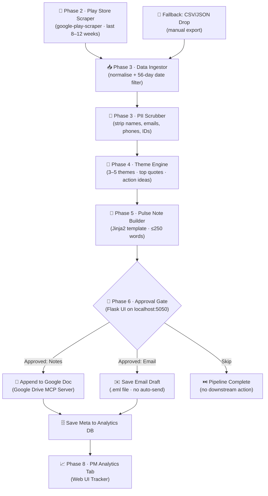
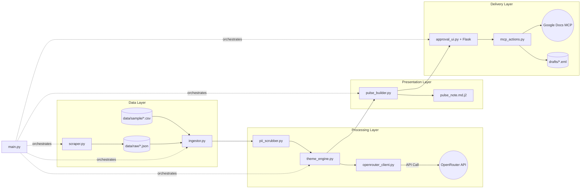
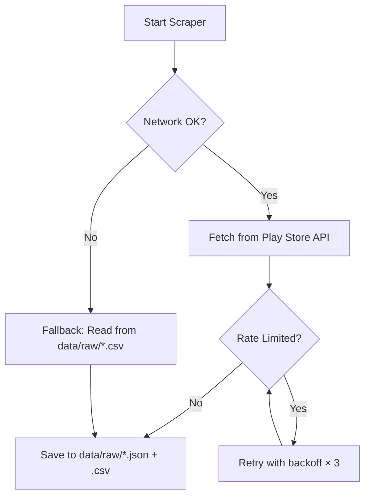
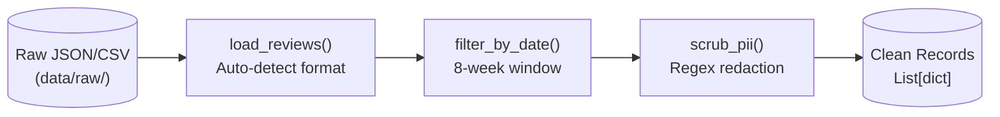
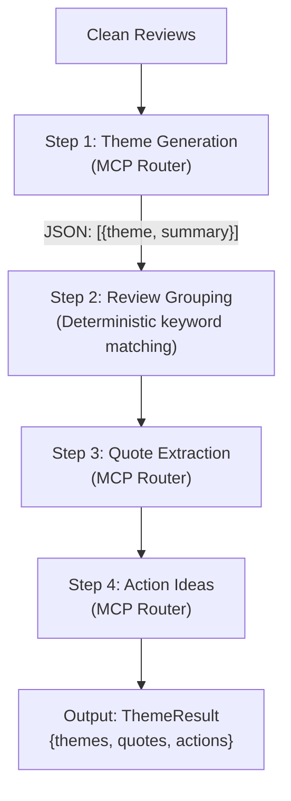
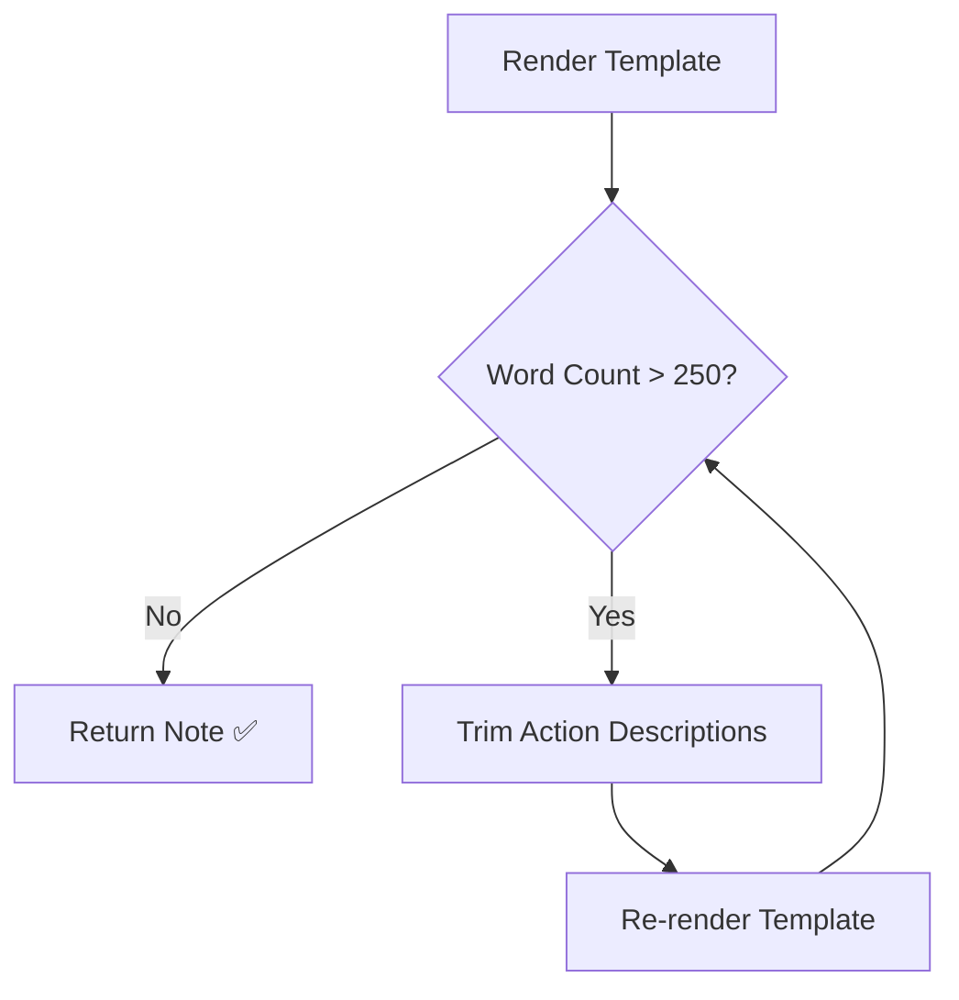
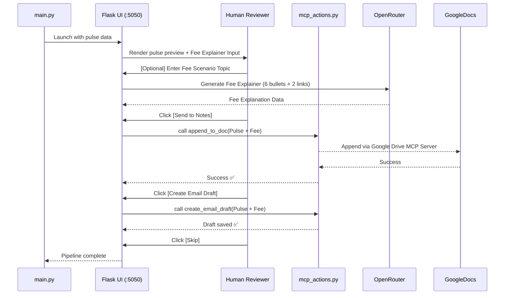
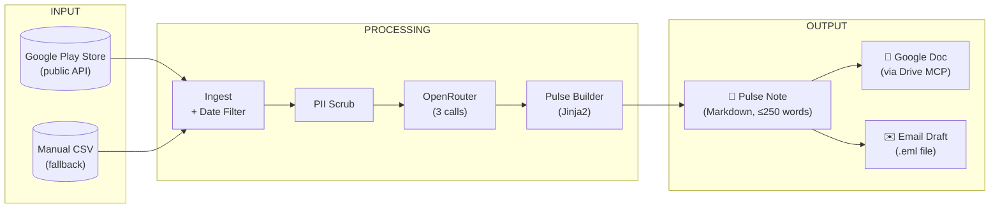

# 🏦 INDMoney Weekly App Review Pulse — Architecture Document

> **Product:** INDMoney (com.indmoney.indstocks)  
> **Version:** 1.0  
> **Last Updated:** 2026-03-10  

---

## Table of Contents

1. [Project Overview](#1-project-overview)
2. [System Architecture](#2-system-architecture)
3. [Technology Stack](#3-technology-stack)
4. [Phase 1 — Project Scaffold & Configuration](#phase-1--project-scaffold--configuration)
5. [Phase 2 — Play Store Review Scraper](#phase-2--play-store-review-scraper)
6. [Phase 3 — Data Ingestion & PII Scrubbing](#phase-3--data-ingestion--pii-scrubbing)
7. [Phase 4 — LLM Theme Engine](#phase-4--llm-theme-engine)
8. [Phase 5 — Weekly Pulse Note Builder](#phase-5--weekly-pulse-note-builder)
9. [Phase 6 — MCP Approval-Gated Actions](#phase-6--mcp-approval-gated-actions)
10. [Phase 7 — Verification & Testing](#phase-7--verification--testing)
11. [Phase 8 — PM Analytics & Retrospection (Web UI)](#phase-8--pm-analytics--retrospection-web-ui)
12. [Data Flow Summary](#data-flow-summary)
13. [Deployment Strategy (GitHub Actions + Hugging Face)](#deployment-strategy-github-actions--hugging-face)
14. [Security & Privacy](#security--privacy)
15. [Constraints & Guardrails](#constraints--guardrails)

---

## 1. Project Overview

### 1.1 Problem Statement

Product, support, and leadership teams at INDMoney need a concise, recurring view of what users are saying about the app. Manually reading hundreds of Play Store reviews every week is unsustainable and error-prone. There is no automated mechanism to surface themes, representative quotes, or actionable product ideas from public user feedback.

### 1.2 Solution

An automated pipeline that:

1. **Scrapes** the latest 8–12 weeks of Google Play Store reviews for INDMoney
2. **Cleans** and **de-identifies** the data (no PII)
3. **Groups** reviews into 3–5 themes using an LLM (OpenRouter)
4. **Generates** a ≤250-word, scannable weekly pulse note with top themes, user quotes, and action ideas
5. **Delivers** the note as an email draft via an approval-gated workflow (no auto-send)

### 1.3 Who This Helps

| Stakeholder | Value |
|---|---|
| **Product / Growth Teams** | Understand what to fix or build next based on real user sentiment |
| **Support Teams** | Know what users are reporting and acknowledge recurring issues |
| **Leadership** | Get a quick weekly health pulse without reading raw reviews |

---

## 2. System Architecture

### 2.1 High-Level Pipeline




### 2.2 Component Interaction Diagram



---

## 3. Technology Stack

| Category | Technology | Purpose |
|---|---|---|
| **Language** | Python 3.10+ | Core runtime |
| **Review Scraping** | `google-play-scraper` ≥ 1.2.4 | Fetch public Play Store reviews (no API key needed) |
| **Data Processing** | `pandas` ≥ 2.0.0 | DataFrame operations, date filtering, normalisation |
| **LLM** | `requests` ≥ 2.25.0 | Chat completions via OpenRouter HTTP API |
| **Templating** | `jinja2` ≥ 3.1.0 | Markdown pulse note rendering |
| **Web UI** | `flask` ≥ 3.0.0 | Approval gate UI (localhost:5050) |
| **MCP Client** | `mcp` SDK | Tool-calling for downstream actions (Notes, Email) |
| **Config** | `python-dotenv` ≥ 1.0.0 | Load secrets from `.env` |
| **Testing** | `pytest` | Unit and integration tests |
| **PII Removal** | `re` (stdlib) | Regex-based redaction |
| **Email** | `smtplib` + `email.mime` (stdlib) | Compose `.eml` draft files |

---

## Phase 1 — Project Scaffold & Configuration

### Goal

Establish the directory structure, dependency management, environment configuration, and the main orchestrator entry point.

### Directory Structure

```
INDMoney_Pulse_Generator/
├── data/
│   ├── raw/                        # Scraped reviews (auto-generated JSON/CSV)
│   └── sample/                     # Sample data for offline testing
├── outputs/
│   └── drafts/                     # Saved .eml email drafts
├── phase1_scaffold/

│   └── config.py                   # Central config loader (reads .env)
├── phase2/
│   └── scraper.py                  # Play Store scraper
├── phase3_ingestion/
│   ├── ingestor.py                 # CSV/JSON loader + date filter
│   └── pii_scrubber.py             # PII removal
├── phase4_theme_engine/
│   ├── openrouter_client.py        # OpenRouter API wrapper
│   └── theme_engine.py             # Theme generation + quote + action extraction
├── phase5_builder/
│   ├── pulse_builder.py            # Note assembly
│   └── templates/
│       └── pulse_note.md.j2        # Jinja2 template
├── phase6_approval/
│   ├── approval_ui.py              # Flask web UI
│   ├── templates/
│   │   └── approval.html           # Approval page template
│   └── mcp_actions.py              # MCP client actions
├── tests/
│   ├── test_scraper.py
│   ├── test_ingestor.py
│   ├── test_pii_scrubber.py
│   ├── test_theme_engine.py
│   └── test_pulse_builder.py
├── main.py                         # Root orchestrator
├── requirements.txt
├── .env.example
├── .env                            # (git-ignored) actual secrets
├── architecture.md                 # This document
└── README.md
```

### Key Files

#### `requirements.txt`

```
groq>=0.9.0
python-dotenv>=1.0.0
pandas>=2.0.0
jinja2>=3.1.0
google-play-scraper>=1.2.4
flask>=3.0.0
mcp
pytest
```

#### `.env.example`

```env
OPENROUTER_API_KEY=your_openrouter_api_key_here
APP_ID=com.indmoney.indstocks
REVIEW_COUNT=1000
WEEKS_BACK=8

SMTP_HOST=smtp.gmail.com
SMTP_PORT=587
SMTP_USER=your_email@gmail.com
SMTP_PASS=your_app_password
EMAIL_TO=your_email@gmail.com

MCP_COMMAND=npx
MCP_ARGS=-y,@modelcontextprotocol/server-everything
```

#### `main.py` — Orchestrator Flow

```
┌────────────────────────────────────────────────┐
│  Phase 1: Load config from .env                │
│  Phase 2: Scrape Play Store → data/raw/*.json  │
│  Phase 3: Ingest + PII scrub → clean records   │
│  Phase 4: OpenRouter LLM → themes, quotes, actions │
│  Phase 5: Build pulse note (≤250 words)         │
├────────────────────────────────────────────────┤
│  ⚠️  APPROVAL GATE (Flask UI @ :5050)           │
│  Options: [Notes] [Email Draft] [Skip]          │
├────────────────────────────────────────────────┤
│  Phase 6a: Append to Google Doc (via MCP)       │
│  Phase 6b: Save .eml email draft                │
└────────────────────────────────────────────────┘

```

### Decisions & Rationale

- **Phase-wise folder structure**: Each phase is self-contained for clarity, testability, and independent development.
- **`.env` for secrets**: No credentials in code; `.env` is gitignored.
- **`main.py` as thin orchestrator**: Calls each phase sequentially, making the pipeline easy to debug and extend.

---

## Phase 2 — Play Store Review Scraper

### Goal

Automatically fetch the most recent reviews for INDMoney from Google Play Store using only public APIs (no login, no proprietary keys).

### Technical Design

| Parameter | Value |
|---|---|
| **Library** | `google-play-scraper` (pip-installable, public API) |
| **App ID** | `com.indmoney.indstocks` (configurable via `.env`) |
| **Review count** | Up to **1000** most recent reviews per run |
| **Language / Country** | `lang='en'`, `country='in'` |
| **Sort order** | `Sort.NEWEST` (most recent first) |
| **Output format** | `data/raw/playstore_reviews_<YYYYMMDD>.json` |

### Module: `phase2/scraper.py`

#### API Contract

```python
def fetch_reviews(app_id: str, count: int = 1000) -> list[dict]:
    """
    Fetches `count` most recent reviews from Google Play Store.

    Returns:
        List of dicts with keys: rating, title, text, date
        (normalised from Play Store native fields)
    """

def save_reviews(reviews: list[dict], output_dir: str) -> str:
    """
    Saves reviews to JSON file in output_dir.
    Also exports a normalised CSV alongside the JSON.

    Returns:
        Path to saved JSON file
    """
```

#### Field Mapping (Play Store → Internal)

| Play Store Field | Internal Field | Notes |
|---|---|---|
| `score` | `rating` | Integer 1–5 |
| `content` | `text` | Full review body |
| `at` (datetime) | `date` | ISO 8601 string |
| *(not available)* | `title` | Set to `""` (Play Store has no title) |
| `thumbsUpCount` | *(dropped)* | Not used downstream |
| `reviewId` | *(dropped)* | PII-adjacent, not stored |

#### Error Handling & Fallback



---

## Phase 3 — Data Ingestion & PII Scrubbing

### Goal

Normalise scraped/CSV reviews, apply the configurable date window filter, and ensure zero PII reaches downstream components.

### Module: `phase3_ingestion/ingestor.py`

#### API Contract

```python
def load_reviews(source_path: str) -> pd.DataFrame:
    """
    Auto-detects JSON or CSV format and loads into DataFrame.
    Normalises column names to: rating, title, text, date
    """

def filter_by_date(df: pd.DataFrame, weeks_back: int = 8) -> pd.DataFrame:
    """
    Keeps only reviews within the last `weeks_back` weeks from today.
    Default: 56 days (8 weeks). Configurable up to 12 weeks (84 days).
    """

def ingest(source_path: str, weeks_back: int = 8) -> list[dict]:
    """
    Full pipeline: load → filter → return list of clean dicts.
    """
```

#### Date Filter Logic

```
today = 2026-03-10
cutoff = today - (weeks_back × 7) days
keep reviews WHERE date >= cutoff
```

### Module: `phase3_ingestion/pii_scrubber.py`

#### API Contract

```python
def scrub_pii(reviews: list[dict]) -> list[dict]:
    """
    Strips PII from 'title' and 'text' fields.
    Returns new list with redacted copies (does not mutate input).
    """
```

#### PII Patterns Redacted

| Pattern | Regex | Example | Replacement |
|---|---|---|---|
| **Email addresses** | `[\w.-]+@[\w.-]+\.\w+` | `user@gmail.com` | `[REDACTED]` |
| **Phone numbers (Indian)** | `\+?91[\s-]?\d{10}` or `\d{10}` | `+91 9876543210` | `[REDACTED]` |
| **Phone numbers (Intl)** | `\+\d{1,3}[\s-]?\d{7,12}` | `+1-555-1234567` | `[REDACTED]` |
| **Usernames** | Reviewer display names (if present) | `John D.` | `[REDACTED]` |
| **Sensitive URL tokens** | URLs containing tokens/keys | `https://api.com?key=abc` | `[REDACTED]` |

#### Data Flow



---

## Phase 4 — LLM Theme Engine

### Goal

Use LLMs to generate themes from review data, extract representative quotes, and produce actionable product improvement ideas.

### Architecture Decision: OpenRouter API

We route all LLM requests through **OpenRouter** using the `anthropic/claude-3-haiku` model (or fallback models like `google/gemini-2.0-flash-lite-preview` for robust quote extraction).

### Module: `phase4_theme_engine/openrouter_client.py`

#### API Contract

```python
class OpenRouterClient:
    def __init__(self, api_key: str, model: str = "liquid/lfm-2.5-1.2b-thinking:free"):
        """Initialise OpenRouter HTTP client."""

    def chat_completion(self, system_prompt: str, user_prompt: str) -> str:
        """
        Send a chat completion request to OpenRouter REST API.
        Strips <think> tags and markdown code fences from response.
        Retries up to 3 times with exponential backoff.
        """
```

> Uses `requests.post` to `https://openrouter.ai/api/v1/chat/completions` with `Authorization: Bearer <key>` header.

### Module: `phase4_theme_engine/theme_engine.py`

#### Three-Step LLM Pipeline




#### Step 1 — Theme Generation (LLM Call #1)

**System prompt** instructs the LLM to:
- Analyse all review texts (batched if > 100 reviews)
- Return **3–5 distinct themes** in strict JSON format
- Use neutral language, no PII

**Expected output schema:**
```json
[
  {"theme": "App Crashes on Login", "summary": "Multiple users report crashes when ..."},
  {"theme": "Slow Fund Transfers", "summary": "Users frustrated by 2-3 day delays ..."},
  {"theme": "Great Investment UI", "summary": "Positive feedback on portfolio view ..."}
]
```

#### Step 2 — Review Grouping (Deterministic)

Each review is scored against theme keywords returned by the LLM and assigned to the best-matching theme. This is **not** an LLM call — it uses keyword/semantic overlap to ensure deterministic, reproducible grouping.

#### Step 3 — Quote Extraction (LLM Call #2)

Picks **3 verbatim user quotes** (one per top theme) that best illustrate each theme. Quotes are anonymised — no user identifiers included.

#### Step 4 — Action Ideas (LLM Call #3)

Generates **3 concrete, actionable product improvement ideas** based on the top 3 themes. Each action idea is specific and implementable.

#### API Contract

```python
@dataclass
class ThemeResult:
    themes: list[dict]     # [{theme: str, summary: str, review_count: int}]
    quote: str             # 1 anonymised verbatim best quote
    actions: list[str]     # 3 actionable product ideas

def analyze_reviews(reviews: list[dict]) -> ThemeResult:
    """
    Full theme pipeline: generate → group → extract best quote → action ideas.
    Makes 3 LLM calls total.
    """
```

---

## Phase 4B — Fee Explainer Engine

### Goal

Generate a structured, neutral explanation for a specific fee scenario (e.g., brokerage, exit load) as requested by the user during the approval phase.

### Module: `phase4_theme_engine/fee_explainer.py`

#### Requirements
- **Trigger**: User inputs a "scenario" (e.g., "What is the exit load for debt funds?") in the Phase 6 UI.
- **Output**: 
    - ≤6 bullet points.
    - 2 official source links (preferably active).
    - "Last checked: [Today's Date]".
- **Tone**: Neutral, facts-only. No recommendations or comparisons.

#### Data Flow
1. User enters scenario in Approval UI.
2. UI calls `fee_explainer.generate_explanation(scenario)`.
3. Engine performs a web search (optional) to find latest data/links.
4. Engine calls OpenRouter to structure the response.
5. Response is displayed in UI for preview and included in final output.

#### Official Sources for Reference
The engine should prioritize or reference these official domains:
- **INDMoney Pricing (Stocks/General)**: `https://www.indmoney.com/pricing`
- **INDMoney Mutual Funds**: `https://www.indmoney.com/mutual-funds/pricing`
- **INDMoney US Stocks**: `https://www.indmoney.com/us-stocks/pricing`
- **Regulatory (SEBI)**: `https://www.sebi.gov.in`
- **Regulatory (RBI)**: `https://www.rbi.org.in`
- **Taxation (Income Tax Dept)**: `https://www.incometax.gov.in`

---

## Phase 5 — Weekly Pulse Note Builder

### Goal

Produce a ≤250-word, scannable, one-page weekly pulse note in Markdown format, ready for email delivery.

### Module: `phase5_builder/pulse_builder.py`

#### API Contract

```python
def build_pulse_note(
    themes: list[dict],
    quotes: list[str],
    actions: list[str],
    review_count: int,
    week_date: str
) -> str:
    """
    Renders the Jinja2 template with provided data.
    Enforces ≤250 word count — trims action descriptions if exceeded.

    Returns:
        Rendered Markdown string
    """
```

### Template: `phase5_builder/templates/pulse_note.md.j2`

```markdown
## 🏦 IND Money — Weekly App Review Pulse
**Week of:** {{ week_date }}  |  **Reviews analysed:** {{ review_count }}

---

### 🔍 Top Themes This Week

**{{ loop.index }}. {{ t.theme }}** — {{ t.summary }}


### 💬 What Users Are Saying

> "{{ q }}"


### 🚀 Three Action Ideas

{{ loop.index }}. {{ a }}


---
*Generated {{ generated_at }} · No PII included*
```

### Word Count Guard



The builder iteratively trims the longest action idea description until the total word count is ≤250.

### Output Sample Structure

The note follows this strict layout:

| Section | Content | Max Items |
|---|---|---|
| **Header** | Product name, week, review count | — |
| **Top Themes** | Theme name + one-line summary | 3–5 |
| **User Quotes** | Verbatim anonymised quotes | 3 |
| **Action Ideas** | Numbered improvement suggestions | 3 |
| **Footer** | Generation timestamp, PII disclaimer | — |

---

## Phase 6 — MCP Approval-Gated Actions

### Goal

After the pulse note is generated, **pause for human approval** before performing any downstream actions. Nothing is auto-sent or auto-saved without explicit user consent.

### Architecture: Approval Gate



### Module: `phase6_approval/approval_ui.py`

- **Framework**: Flask
- **Port**: `localhost:5050`
- **Routes**:

| Route | Method | Purpose |
|---|---|---|
| `/` | GET | Render pulse note preview + Fee Explainer search box |
| `/generate_fee` | POST | Call Phase 4B to generate explanation for input scenario |
| `/approve/notes` | POST | Trigger append to Google Doc via MCP (includes Pulse + Fee) |
| `/approve/email` | POST | Trigger `.eml` draft creation (includes Pulse + Fee) |
| `/approve/skip` | POST | End pipeline with no action |


### Module: `phase6_approval/mcp_actions.py`

#### Action A — Append to Google Doc (via MCP)

Instead of a local JSON file, the pulse note is appended directly to a Google Document using the official Google Drive MCP server.

The MCP client connects to the Google Drive server to read the target document and append the rendered markdown response to the end of the file.

The target Google Doc ID or Name is loaded via `.env` configuration.


#### Action B — Create Email Draft

Composes an `.eml` file saved to `outputs/drafts/pulse_draft_<YYYYMMDD>.eml`:

| Email Field | Value |
|---|---|
| **Subject** | `Weekly Pulse — INDMoney — <date>` |
| **To** | Value from `EMAIL_TO` in `.env` |
| **From** | Value from `SMTP_USER` in `.env` |
| **Body** | Full pulse note (Markdown rendered to HTML) |
| **Auto-send** | ❌ **No** — saved as `.eml` file only |

The user can open the `.eml` in any email client and send manually.

---

## Phase 7 — Verification & Testing

### Goal

Validate that every phase works correctly, all constraints are met, and the end-to-end pipeline produces the expected output.

### Test Suite

| Test File | Phase | What It Covers |
|---|---|---|
| `tests/test_scraper.py` | 2 | Field mapping, short review filtering, empty response handling |
| `tests/test_ingestor.py` | 3 | Date filter, missing columns handled, auto-format detection |
| `tests/test_pii_scrubber.py` | 3 | Email, phone, UPI, URL redaction; no false positives |
| `tests/test_theme_engine.py` | 4 | Theme count 3–5, JSON schema validation, LLM error handling |
| `tests/test_fee_explainer.py` | 4B | Fee explanation generation, JSON parsing failures |
| `tests/test_pulse_builder.py` | 5 | Word count ≤ 250, template rendering, trimming logic |
| `tests/test_mcp_actions.py` | 6 | Notes append, email draft creation, fee inclusion, no auto-send |

### Run Commands

```bash
# Run all tests
pytest tests/ -v

# Run phase-specific tests
pytest tests/test_scraper.py -v        # Phase 2
pytest tests/test_ingestor.py -v       # Phase 3
pytest tests/test_pii_scrubber.py -v   # Phase 3
pytest tests/test_theme_engine.py -v   # Phase 4
pytest tests/test_pulse_builder.py -v  # Phase 5
```

### End-to-End Validation Checklist

| # | Checkpoint | Expected Result |
|---|---|---|
| 1 | Run `python main.py` | Pipeline starts, scraper fetches reviews |
| 2 | Console shows review count | `✅ Scraped N reviews from Play Store` |
| 3 | Date filter applied | Only reviews from last 8 weeks retained |
| 4 | PII scrubbed | Any injected emails/phones show as `[REDACTED]` |
| 5 | Themes generated | 3–5 themes printed with summaries |
| 6 | Pulse note rendered | ≤250 words, correct Markdown structure |
| 7 | Flask UI launches | Browser opens `http://localhost:5050` |
| 8 | Action: Notes | Google Doc updated via MCP |
| 9 | Action: Email | `outputs/drafts/pulse_draft_<date>.eml` created |
| 10 | No auto-send | `.eml` file exists but was **not** transmitted |


### Constraint Validation Matrix

| Constraint | Enforcement Point | Validation |
|---|---|---|
| Max 5 themes | `theme_engine.py` prompt + JSON parsing | `test_theme_engine.py` |
| Note ≤ 250 words | `pulse_builder.py` word count guard | `test_pulse_builder.py` |
| No PII in artifacts | `pii_scrubber.py` regex pipeline | `test_pii_scrubber.py` |
| No auto-send email | `.eml` file only, no SMTP `send()` | Manual verification |
| Public data only | `google-play-scraper` (no login) | By design |
| Approval gate | Flask UI blocks delivery actions | Manual verification |

---

## Phase 8 — PM Analytics & Retrospection (Web UI)

### Goal

Provide an "Analytics Tab" in the web UI (Approval UI) to track longitudinal sentiment trends and theme life cycles. This answers whether fixes are working and whether new issues are emerging over time.

### Architecture Design for Analytics Storage & Retrieval

To support analytics without over-engineering a heavy database, we will capture key metrics at the end of every successful pipeline run (e.g., when a Pulse is approved) and store them in a persistent datastore (e.g., a local SQLite database or Google Sheets via MCP).

#### Component: Analytics Datastore
When Phase 6 actions are approved, the following fields will be appended to an `analytics_history` table/sheet:
- `week_date`: The generation date of the pulse.
- `total_reviews`: Number of processed reviews.
- `avg_rating`: Average rating of the ingested batch.
- `theme_1`, `theme_2`, `theme_3`: The string titles of the top themes generated.

### Point 1. Theme & Issue Lifecycle Analytics (Feature Focus)
The Analytics Tab will query the historical datastore to visualize:
- **Theme Recurrence Rate:** A tracker showing how many consecutive weeks a theme (using exact or high-similarity match) appears in the Top 3.
- **Time-to-Resolution (TTR):** A calculated metric for the latency between a theme first appearing and falling off the top themes list.
- **New vs. Recurring Themes:** A clear delineation identifying if the week's themes are regressions/persistent or entirely new problems.
- **Theme Dominance:** Charts showing the breakdown of review volumes claimed by the Top 3 themes.

### Point 2. User Sentiment & Review Volume Analytics (App Health)
The UI will display high-level trend graphs mapping:
- **Weekly Sentiment Velocity:** A line chart of the `avg_rating` of ingested reviews over the past N weeks.
- **Volume Spikes:** A component showing total reviews processed per week, allowing PMs to correlate volume spikes with sentiment drops.
- **5-Star vs 1-Star Ratio:** A stacked bar/trend comparison of extreme positive vs extreme negative reviews week over week.

### Web UI Integration (`phase6_approval/approval_ui.py`)
- The existing Flask application will be expanded with a new route (`/analytics`).
- Rendered via a new template: `phase6_approval/templates/analytics.html`.
- Uses lightweight JS charting libraries (e.g., Chart.js) to consume the analytics datastore output.

---

## Data Flow Summary




---

## Deployment Strategy (GitHub Actions + Hugging Face)

### Goal
To run the INDMoney Pulse Generator pipeline automatically and completely for free, using GitHub for compute and Hugging Face for the Web UI, with persistent storage elegantly managed via Git Sync.

### Infrastructure: The Git-Sync Architecture
This deployment uses a dual-platform approach to bypass the ephemeral storage limitations of free cloud tiers.

| Component | Strategy |
|---|---|
| **cron Schedule** | [GitHub Actions](https://github.com/features/actions) runs `main.py` every Friday at 9:00 AM IST. |
| **Compute (Scraper)** | Ephemeral `ubuntu-latest` runner executes the heavy scraping and LLM parsing. |
| **Compute (Web UI)** | [Hugging Face Spaces](https://huggingface.co/spaces) (Docker Space) permanently runs the Flask Approval UI on port `7860`. |
| **Storage Persistence** | **Git Commits.** Instead of relying on a database, GitHub Actions automatically commits the generated JSON reviews and `.eml` drafts back into the GitHub repository's `outputs/` folder. |
| **Synchronization** | Hugging Face Spaces is linked to the GitHub repository. When the Action pushes the new files, HF Spaces automatically pulls them and makes them available in the Flask UI. |

### Data Flow
1. **[GitHub]** Actions Cron triggers `main.py` at 9:00 AM Friday.
2. **[GitHub]** Pipeline scrapes Play Store, calls OpenRouter, and saves the new Pulse data locally on the runner.
3. **[GitHub]** Actions commits the new data (`outputs/`, `data/`) back to the `main` branch.
4. **[Hugging Face]** Detects the commit, pulls the fresh data, and updates the live Flask UI.
5. **[Human]** PM logs into the Hugging Face Space URL, reviews the fresh pulse, and clicks **[Send to Notes]**.
6. **[Hugging Face]** Flask UI triggers the MCP connection and writes the final approved version to Google Docs.

---

## Security & Privacy

### Principle: Zero PII Exposure

Every artifact produced by this pipeline is stripped of personally identifiable information before it reaches downstream consumers.

| Layer | Mechanism |
|---|---|
| **Scraper** | `reviewId` and user profile fields are **dropped** at collection time |
| **PII Scrubber** | Regex patterns catch emails, phones, usernames, sensitive URLs |
| **LLM Prompts** | System prompt explicitly instructs: *"Do not include any names, emails, or identifiers"* |
| **Output** | Footer includes `No PII included` disclaimer |

### Secrets Management

| Secret | Storage | Access |
|---|---|---|
| `OPENROUTER_API_KEY` | `.env` (gitignored) | `python-dotenv` → `os.getenv()` |
| `OPENROUTER_API_KEY` | `.env` (gitignored) | `python-dotenv` → `os.getenv()` |
| `SMTP_USER` / `SMTP_PASS` | `.env` (gitignored) | Only used for `.eml` composition |
| `EMAIL_TO` | `.env` (gitignored) | Recipient address |

> ⚠️ **Never** commit `.env` to version control. The `.env.example` template contains placeholder values only.

---

## Constraints & Guardrails

| Constraint | Limit | Enforcement |
|---|---|---|
| Theme count | 3–5 max | LLM prompt + validation in `theme_engine.py` |
| Pulse note length | ≤ 250 words | Word count guard in `pulse_builder.py` |
| PII exposure | Zero tolerance | `pii_scrubber.py` + LLM prompt instructions |
| Email delivery | No auto-send | `.eml` file only; no `smtplib.send()` call |
| Data source | Public only | `google-play-scraper` (no login/scraping behind auth) |
| Review window | 8–12 weeks | Configurable `WEEKS_BACK` in `.env` (default: 8) |
| Approval gate | Required before actions | Flask UI on `localhost:5050` |
| Review count per run | Up to 1000 | Configurable `REVIEW_COUNT` in `.env` |

---

*Generated 2026-03-10 · INDMoney Weekly Pulse Generator v1.0*
